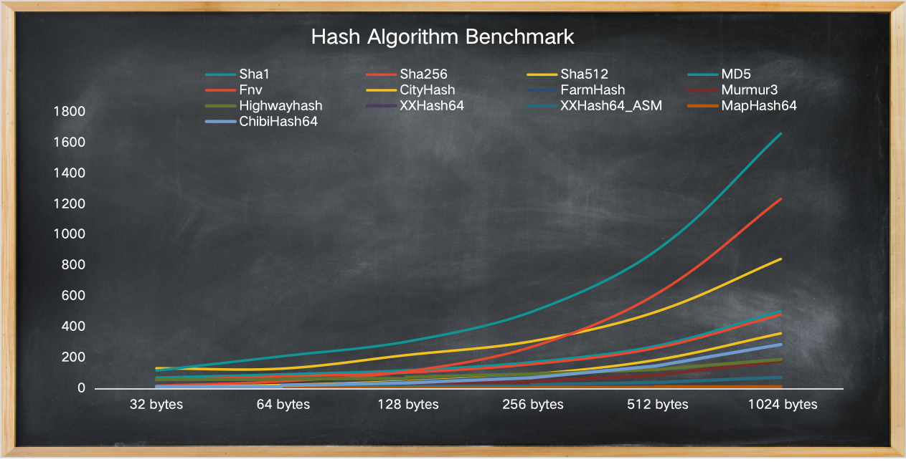

# Benchmark for Hash algorithm in Go

- SHA1
- SHA256
- SHA512
- MD5
- Fnv
- [CityHash](https://bitbucket.org/creachadair/cityhash)
- [FarmHash](https://github.com/leemcloughlin/gofarmhash)
- [Murmur3](https://github.com/spaolacci/murmur3)
- [HighwayHash](https://github.com/minio/highwayhash)
- [XXHash](https://github.com/pierrec/xxHash/xxHash64)
- [XXHash with ASM](https://github.com/cespare/xxhash)
- [chibihash](https://github.com/smallnest/chibihash)

